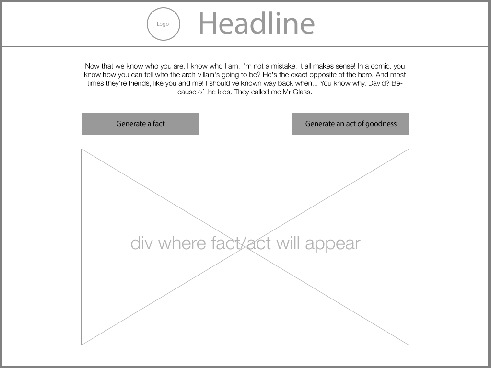

# The-Little-Things

My project is going to be a social progress inspired app. It's "The Little Things" as in the little things we can do to make the world a better place. I want the user to be able to see two "generate buttons". One for generating a fact (which I'm thinking about using an API for) and one for generating an "act" (like an act of goodness) which will appear on the body. EAch time a button is clicked, a different fact/act is shown on the DOM. Not just appending a new thing each time. Maybe make certain categories for the fact/act that'll be styled the same but maybe color coded? So like if it's health, use red. for environment, it's green. Etcetera. I'm contemplating making it an express app and using handlebars to render out the data from the api. I think just the generator will be my MVP. Also add a button for creating a new actAs a bonus, I can make a page of resources, maybe use animate.css to make some presentation like thing. 

Maybe also use an API for volunteer organizations/opportunities near you.

To be honest I really don't know what to do for the ERD. 

